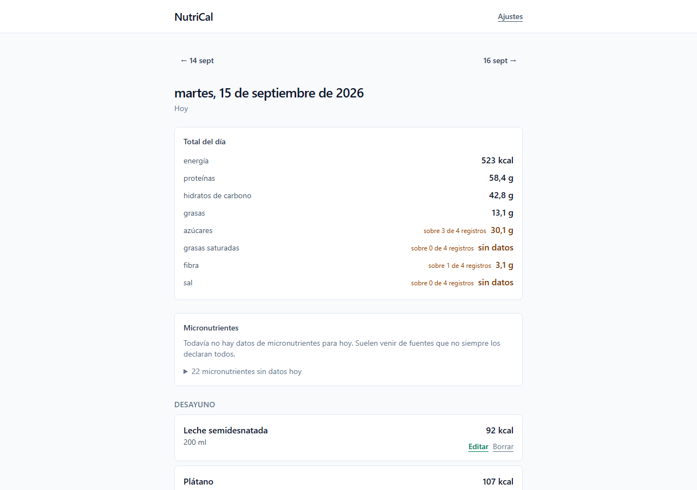
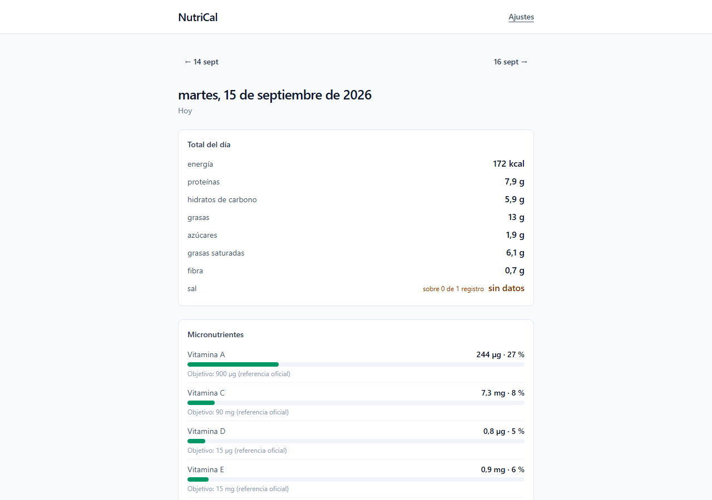
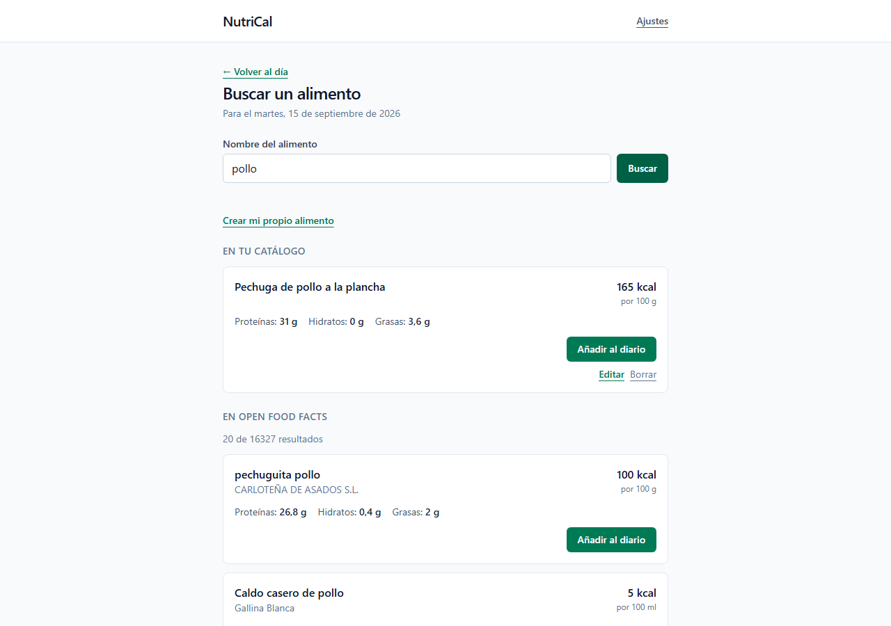
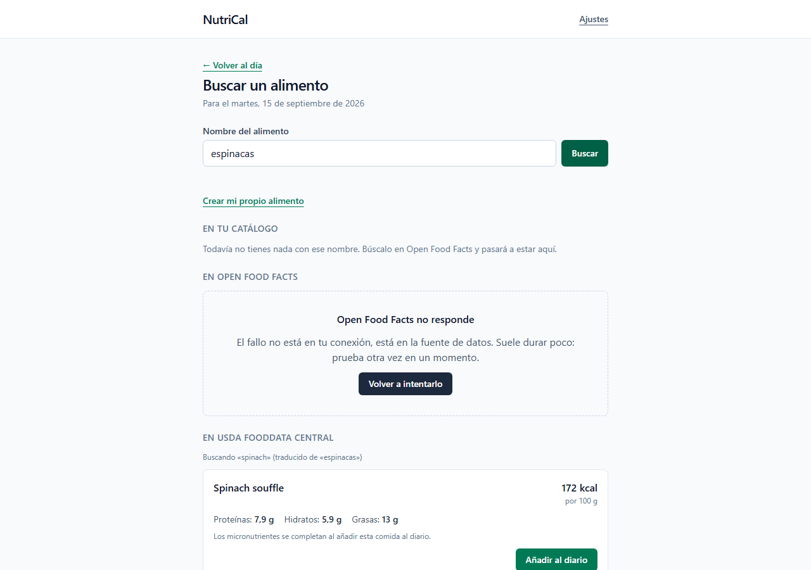

# NutriCal

Aplicación web progresiva para registrar comidas, con seguimiento de
calorías, macronutrientes y micronutrientes. Funciona sin conexión y sin
crear una cuenta. Los objetivos diarios son totalmente editables, sin
mínimos artificiales de producto ni nada que premie fijarlos más bajos.

**Demo:** https://nutri-cal-ten.vercel.app

> **Esto no es consejo médico.** NutriCal es una herramienta de registro
> personal. No sustituye la valoración de un profesional sanitario.

## Qué es y qué problema resuelve

La mayoría de aplicaciones de conteo de calorías gratuitas comparten tres
fricciones: piden cuenta para guardar nada, esconden el objetivo diario
editable detrás de una suscripción, y separan macronutrientes de
micronutrientes como si fueran dos productos distintos.

NutriCal parte de la decisión contraria en las tres cosas. Todo se guarda en
el propio dispositivo (IndexedDB, vía Dexie.js), así que no hay cuenta que
crear ni servidor que pueda perder tus datos. Los objetivos de calorías y
macros se editan sin límite desde el primer uso, con un único suelo de
seguridad (no permite bajar de una cifra con respaldo clínico, para no
reforzar una restricción alimentaria). Y busca en dos fuentes a la vez —
[Open Food Facts](https://world.openfoodfacts.org/) para lo envasado y
[USDA FoodData Central](https://fdc.nal.usda.gov/) para el detalle de
vitaminas y minerales de lo fresco— porque ninguna de las dos por sí sola
cubre bien las dos cosas.

Es también, por diseño, un proyecto para explicar en una entrevista: cada
decisión de arquitectura no evidente está escrita en [`DECISIONS.md`](DECISIONS.md),
con su contexto, su razón y las alternativas que se descartaron y por qué.

## Capturas

|                                                                     |                                                                             |
| ------------------------------------------------------------------- | --------------------------------------------------------------------------- |
|  |  |
| **Diario del día.** Totales de macros con el recuento de cuántos registros no aportaban cada uno, no un cero silencioso. | **Micronutrientes.** Barra de progreso contra el valor de referencia oficial (EFSA/NIH), citado en el propio panel. |
|  |  |
| **Búsqueda.** Catálogo local, Open Food Facts y la opción de crear un alimento propio, siempre visible. | **Traducción a USDA.** «espinacas» se busca como «spinach», y se dice; un fallo real de la fuente se explica sin culpar a la conexión. |

## Stack

- **Vite + React 19 + TypeScript en modo estricto**, con dos opciones que no
  vienen de serie: `noUncheckedIndexedAccess` y `exactOptionalPropertyTypes`
  (ver más abajo).
- **TanStack Query** para el estado de red y de IndexedDB, con
  `networkMode: 'always'` donde corresponde: leer del propio dispositivo no
  debería esperar a que vuelva la conexión.
- **Zod** valida la frontera con cualquier dato externo: las respuestas de
  las funciones serverless y un archivo importado.
- **Dexie.js** sobre IndexedDB para la persistencia local.
- **Tailwind CSS** para los estilos.
- **Vitest** para los tests; **`@zxing/library`**, cargada solo cuando hace
  falta, como alternativa al `BarcodeDetector` nativo del navegador para
  escanear códigos de barras.
- **`vite-plugin-pwa`** genera el manifest y el service worker: la app se
  puede instalar y el diario sigue disponible sin conexión.
- **Vercel** para el despliegue, con dos funciones serverless propias
  (`api/off/`, `api/usda/`) que son el único punto que habla con las fuentes
  externas.

## Puesta en marcha

Necesitas Node 24 o superior.

```bash
npm install
npm run dev
```

`npm run dev` sirve el frontend **y** las funciones de `api/` en el mismo
servidor y el mismo puerto: no hace falta `vercel dev`, ni un segundo
proceso, ni una cuenta de Vercel para poder buscar un alimento en local. Un
plugin de Vite (`vite.config.ts`) intercepta las peticiones a `/api/*`,
localiza el archivo de `api/` que le corresponde y llama a su función `GET`
con un objeto `Request` de verdad, tal y como haría Vercel en producción.
Los detalles y las alternativas descartadas están en `DECISIONS.md`, entrada
D-051.

Para que las búsquedas de micronutrientes (USDA FoodData Central) funcionen
en local, copia `.env.example` a `.env.local` y rellena `USDA_API_KEY` con
una clave gratuita de https://fdc.nal.usda.gov/api-key-signup. Sin ella, esas
búsquedas fallan con un error controlado y con su propio código
(`server_misconfigured`) en lugar de un fallo confuso; Open Food Facts no
necesita clave y funciona sin este paso.

## Scripts

| Script                  | Qué hace                                           |
| ----------------------- | --------------------------------------------------- |
| `npm run dev`           | Servidor de desarrollo con recarga en caliente.      |
| `npm run build`         | Comprueba tipos y genera la versión de producción.   |
| `npm run preview`       | Sirve en local lo que se generó con `build`.         |
| `npm run typecheck`     | Solo la comprobación de tipos de la aplicación.      |
| `npm run typecheck:api` | Comprobación de tipos de las funciones serverless.   |
| `npm run lint`          | ESLint con reglas basadas en información de tipos.   |
| `npm run format`        | Aplica Prettier a todo el proyecto.                  |
| `npm run format:check`  | Comprueba el formato sin modificar archivos.         |
| `npm test`              | Ejecuta la batería de tests una vez.                 |
| `npm run test:watch`    | Tests en modo continuo mientras programas.           |

La integración continua ejecuta, en cada push y cada pull request: formato,
lint, comprobación de tipos de la aplicación y de las funciones serverless
por separado (D-017), tests, y build de producción.

## Decisiones técnicas destacadas

Cuatro decisiones del proyecto, elegidas porque cada una responde a un
problema real que apareció durante el desarrollo, no a una preferencia de
estilo. El razonamiento completo de cada una, con las alternativas
descartadas, está en `DECISIONS.md`; esto es el resumen pensado para
explicarse sin haber visto antes el código.

### 1. Un proxy serverless propio, porque una API gratuita no siempre se puede llamar directamente desde el navegador (D-013)

Open Food Facts exige, en sus condiciones de uso, una cabecera `User-Agent`
identificativa con nombre de aplicación, versión y contacto — y el
navegador no deja fijar esa cabecera desde JavaScript. Además, su límite de
búsqueda es de diez peticiones por minuto **por dirección IP**, con el
aviso explícito de no usarlo para buscar mientras se teclea. En Vercel esa
dirección IP la comparten todos los proyectos alojados ahí: un uso
descuidado no perjudicaría solo a este proyecto.

La solución no es "pedir con cuidado" desde el cliente, es que el cliente
nunca hable con la fuente. Dos funciones serverless (`/api/off/search`,
`/api/off/product/[barcode]`) son el único punto que llama a Open Food
Facts: añaden la cabecera correcta, piden solo los campos que hacen falta,
y devuelven cabeceras de caché (`stale-while-revalidate`) para que la propia
red de distribución de Vercel guarde la respuesta delante de la función. La
segunda persona que busque "manzana" en todo el mundo ni siquiera ejecuta
código nuestro: la sirve la caché. La misma capa, cuando llegó USDA
FoodData Central (que sí necesita una clave real), fue el sitio obvio para
esconderla — no se construyó dos veces.

### 2. La instantánea de nutrientes: un registro del diario no es una referencia, es una copia (D-003)

Si un registro de comida guardara solo un identificador al alimento del
catálogo ("el yogur que busqué el martes"), y ese alimento viniera de una
fuente externa que corrige sus datos con el tiempo, tu historial cambiaría
solo. Alguien podría, sin hacer nada, despertar con que "comió" ayer una
cantidad de calorías distinta a la que veía ayer.

Por eso `MealEntry` copia dentro de sí mismo el perfil nutricional completo
del alimento en el momento exacto de registrarlo (`FoodSnapshot`), junto con
la porción elegida. Los totales del día se calculan con una función pura a
partir de esa copia, nunca releyendo el catálogo. La alternativa —guardar
también los totales ya escalados, para no tener que calcularlos cada vez—
se descartó a propósito: sería una segunda copia del mismo dato, y un error
en la fórmula de escalado quedaría congelado en los registros antiguos sin
forma de corregirlo. Guardar la instantánea sin escalar es la que sí se
puede corregir en un solo sitio si algún día hace falta.

### 3. Un dato ausente no es un cero: la clave que falta y el valor que vale cero son dos cosas distintas (D-001)

Open Food Facts devuelve productos a los que les falta declarar algún
nutriente. "No lo sabemos" y "vale cero" no son la misma afirmación —el
agua sí tiene cero calorías de verdad, y confundir las dos cosas sumaría
alegremente un cero donde en realidad no hay ningún dato, y el total del
día parecería más preciso de lo que es.

La regla: un nutriente que la fuente no aporta es una **clave ausente** en
el objeto, nunca una clave presente con el valor `null` o `undefined`.
TypeScript, con `exactOptionalPropertyTypes` activado, hace que esta regla
la imponga el compilador y no la disciplina de quien escribe cada línea:
con esa opción, una propiedad declarada `sugars?: Grams` admite que la
clave falte, pero no admite escribir `sugars: undefined` — hay una sola
forma de decir "no lo sé", no dos que puedan desincronizarse. El efecto se
nota en cómo se calculan los totales del día: no se limitan a sumar, cuentan
además cuántos de los registros de ese día sí declaraban cada nutriente, así
que un total puede decir "azúcares: sobre 3 de 4 registros" en vez de fingir
una cifra completa que no lo es.

### 4. Tipos con marca para no poder mezclar gramos con kilocalorías por accidente

Internamente, todo el dominio se mide en gramos, mililitros y kilocalorías
(más miligramos y microgramos para los micronutrientes, que en gramos serían
cifras incómodas como 0,0000024). El riesgo real de un sistema así, en
JavaScript, es que todo eso son simplemente `number`: nada impide, a simple
vista, pasar una cantidad en mililitros donde se esperaban kilocalorías, y
el error no se nota hasta ver un resultado absurdo en pantalla.

La solución son los **tipos con marca** (*branded types*): `type Grams =
Brand<number, 'Grams'>` crea un tipo que en tiempo de ejecución es un
`number` normal, pero que en tiempo de compilación TypeScript no confunde
con otro `number` marcado de otra forma. `Grams` y `Kilocalories` dejan de
ser intercambiables aunque los dos sean, por debajo, el mismo tipo primitivo.
La única forma de obtener uno es a través de su constructor (`grams(150)`,
`kilocalories(89)`), que además valida que el número sea finito y no
negativo — así que la marca no es solo una etiqueta de tipo, es también la
garantía de que ese número pasó por una comprobación antes de circular por
el resto de la aplicación. Es el mismo mecanismo, y la misma razón, por la
que los identificadores de cada entidad (`FoodId`, `MealEntryId`...) tampoco
son intercambiables entre sí aunque los dos sean cadenas.

## Estructura de carpetas

La organización es por dominio, no por tipo de archivo. No hay una carpeta
`components` ni una carpeta `hooks` con todo dentro.

```
src/
  domain/        Tipos y reglas puras. No importa React, ni red, ni base de datos.
    brand.ts       Mecanismo de los tipos con marca.
    units/         Gramos, mililitros, kilocalorías, miligramos, microgramos, minutos.
    identity/      Identificadores UUID, uno por entidad.
    time/          Fecha local YYYY-MM-DD e instante absoluto.
    nutrition/     Macronutrientes, catálogo de micronutrientes y su escalado.
    food/          Alimento, porciones, origen del dato, borrador incompleto, alimentos propios.
    diary/         Registro de comida, registro de ejercicio, resumen del día.
    goals/         Objetivos diarios versionados.
    profile/       Perfil, datos corporales, preferencias de presentación.
    persistence/   Campos comunes de toda entidad guardada, incluida la lápida.
    transfer/      Formato del archivo de exportación e importación.
  features/      Un caso de uso por carpeta, con su interfaz, su estado y sus datos.
    food-search/   Buscar, escanear un código, crear un alimento propio.
    diary/         Registrar, editar y borrar, y los totales del día.
    goals/         Editar los objetivos diarios.
    nutrition/     El panel de micronutrientes.
    profile/       Ajustes, zona horaria, exportar e importar.
  services/      Los dos clientes que hablan con las funciones serverless (OFF, USDA).
  data/          Dexie y repositorios. Envuelve y desenvuelve las entidades.
  shared/        Lo que no tiene un dueño claro: componentes y utilidades comunes.
  app/           Arranque, rutas, providers y layout.

api/             Funciones serverless de Vercel. Proyecto de TypeScript aparte.
  _lib/          Lógica reutilizable: URLs, caché, límite de ritmo, handlers.
  off/           Rutas públicas: búsqueda y producto de Open Food Facts.
  usda/          Rutas públicas: búsqueda y ficha de USDA FoodData Central.

contracts/       Las reglas que el navegador y el servidor cumplen igual, una sola vez.
```

`contracts/` no es un cajón de utilidades compartidas: solo entra aquí lo
que, si se separase en dos copias, rompería el trato entre las dos puntas
(hoy, la validación del código de barras y la normalización del texto de
búsqueda). La carpeta `api` no importa nada de `src`: es otro desplegable,
con otro entorno de ejecución y su propio `tsconfig`.

## Tests

Vitest, con foco en lo que de verdad puede dar un resultado incorrecto sin
que se note: conversión de unidades, cálculo de fechas locales, escalado de
porciones y suma de nutrientes, validación de un archivo importado. No se
prueban componentes de interfaz por sistema.

El caso más ilustrativo está en `src/domain/time/local-date.test.ts`: el
mismo instante es un día distinto según la zona horaria, y por eso un día
del diario es una cadena local y nunca un instante UTC.

## Fuentes de datos

- **Open Food Facts.** Gratuita y sin clave. Búsqueda por texto y por código
  de barras. Sus datos son incompletos e inconsistentes, así que se
  normalizan al entrar.
- **USDA FoodData Central.** Para micronutrientes y para lo fresco (fruta,
  verdura, legumbre) que Open Food Facts cubre peor. Requiere clave, que
  vive siempre en una función serverless y nunca en el navegador, y se
  filtra a propósito para excluir productos de marca (D-053): ese terreno ya
  lo cubre mejor Open Food Facts.
- **Valores de referencia diarios.** De fuentes oficiales europeas (EFSA) y
  estadounidenses (NIH), citadas en el archivo de configuración y editables.

## Licencia

Proyecto personal de portfolio.
